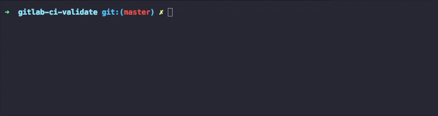

# gitlab-ci-validate

[](https://badge.fury.io/js/gitlab-ci-validate)
[](https://www.npmjs.com/package/gitlab-ci-validate)

Checks if your .gitlab-ci.yml file is valid.

Thanks to [@FGRibreau](https://github.com/FGRibreau) for the post about [validating .gitlab-ci.yml files](http://blog.fgribreau.com/2017/04/validate-gitlab-gitlab-ciyml-one-liner.html)!



### Install:

```
yarn global add gitlab-ci-validate
npm i -g gitlab-ci-validate
```

### Usage:

```
# It will try to find if .gitlab-ci.yml is present on the current folder if no file path is provided
$ gitlab-ci-validate <file-path>

# You can specify your own gitlab host if you need
$ gitlab-ci-validate <file-path> --host https://my-gitlab-url
```

## License

MIT © [Léo Pradel](https://www.leopradel.com/)
